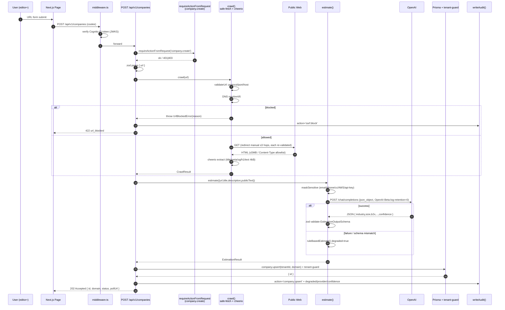
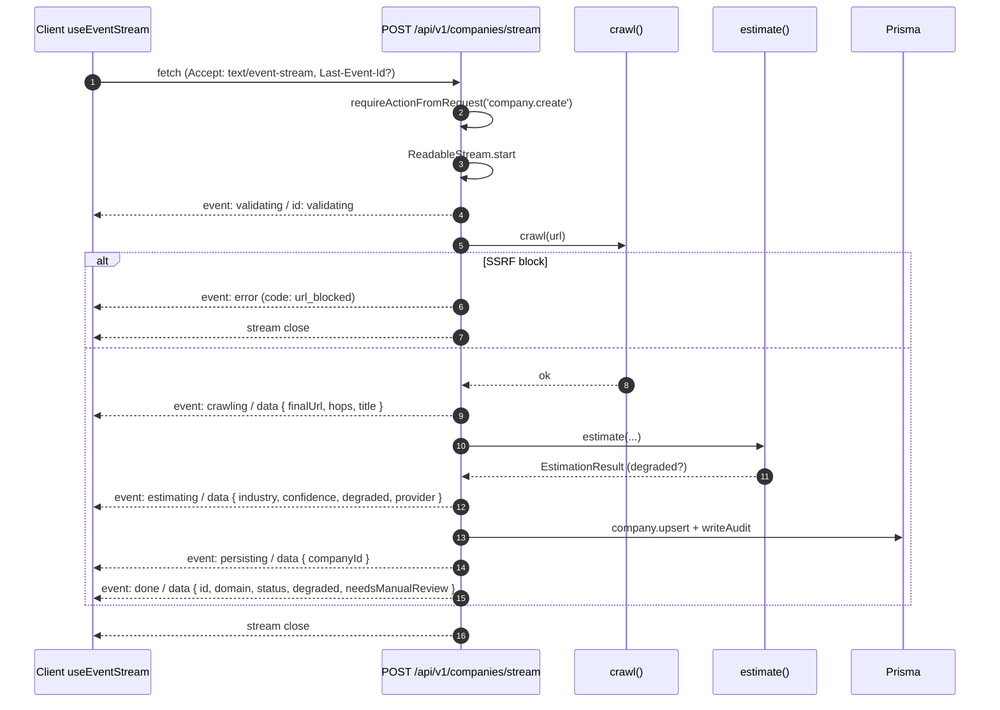
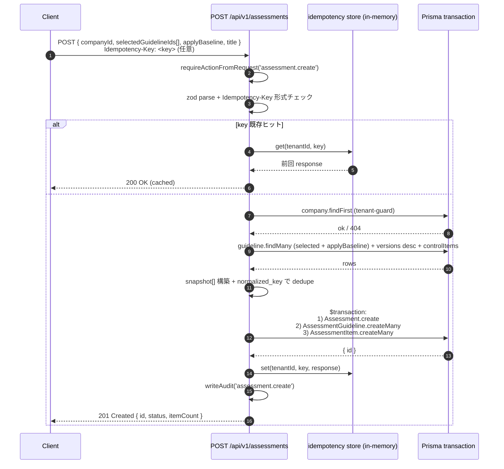
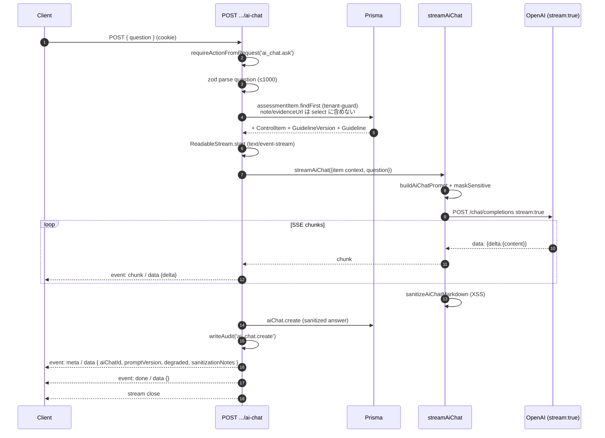
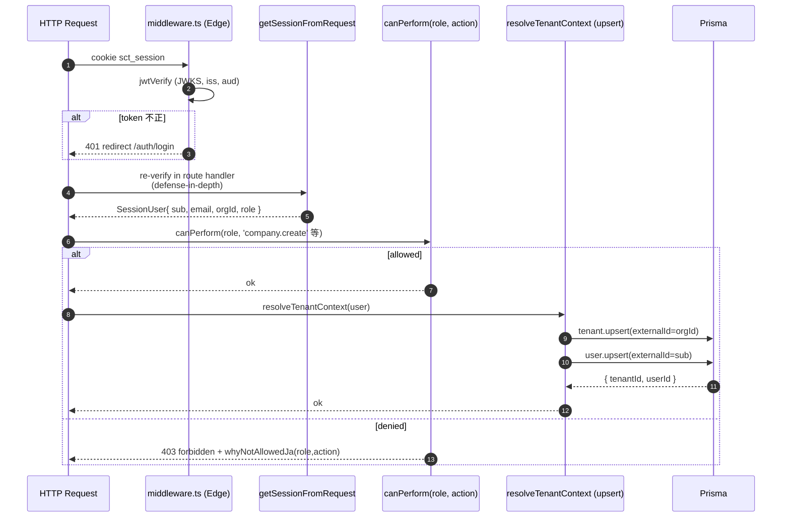

# Sequence Diagrams — security-checklist-tool

**Generated**: 2026-04-30 (Phase 6 / Cycle 6.2)
**Source**: `docs/design/spec.md` §4 / Phase 4 実装

---

## SEQ-1: URL投入 → クロール → LLM 推定 → 保存

`POST /api/v1/companies` (同期版) のフロー。Cycle 2.4 実装。

---

## SEQ-2: SSE 進捗ストリーム (companies/stream)

`POST /api/v1/companies/stream`. Cycle 3.4 実装。

`Last-Event-Id` ヘッダで再開時に該当ステージ以降のイベントから再生。

---

## SEQ-3: Assessment 作成 (Idempotency-Key + bulk-insert)

`POST /api/v1/assessments`. Cycle 2.4 実装。

---

## SEQ-4: AI チャット (SSE chunk → meta → done)

`POST /api/v1/assessment-items/{id}/ai-chat`. Cycle 3.1 実装。

LLM 不在時 (API key 未設定 / 5xx / abort) は **degraded fallback** メッセージを 1 chunk で返却し、参考リンクを末尾付与。

---

## SEQ-5: 認可フロー (requireActionFromRequest)

permissions.ts は spec.md §6.2 マトリクスの SSOT。

---

## 関連ドキュメント

- システム構成: [`system.md`](./system.md)
- API リファレンス: [`../api/api-reference.md`](../api/api-reference.md)
- 設計仕様: [`../design/spec.md`](../design/spec.md)

---
*Phase 6 / Cycle 6.2 — Sequence Diagrams (security-checklist-tool)*
