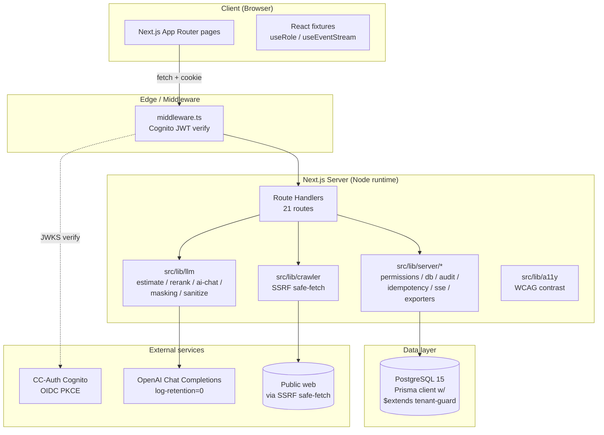
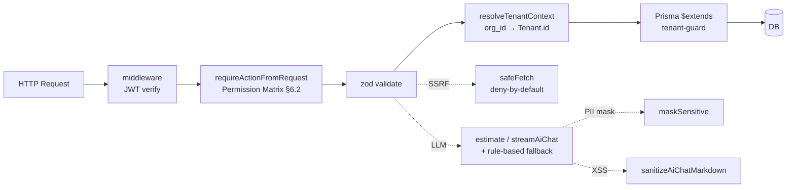
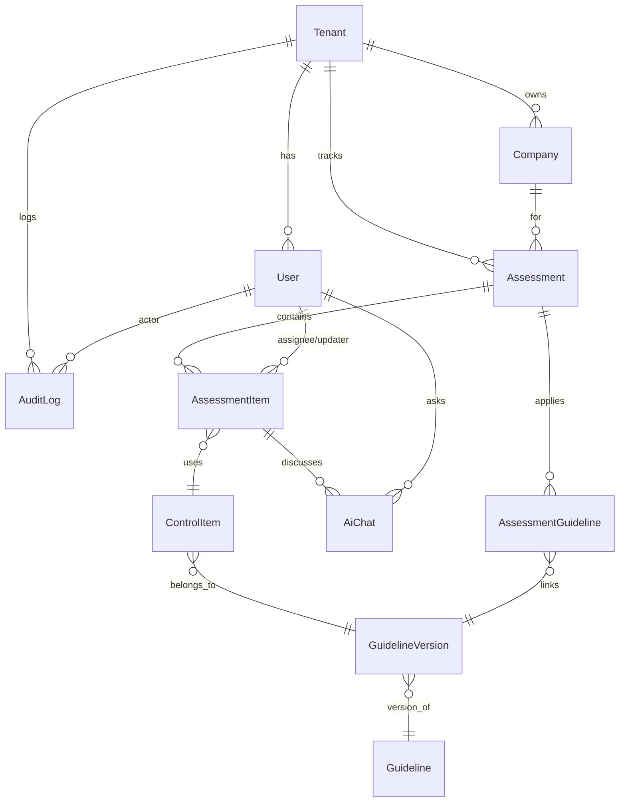
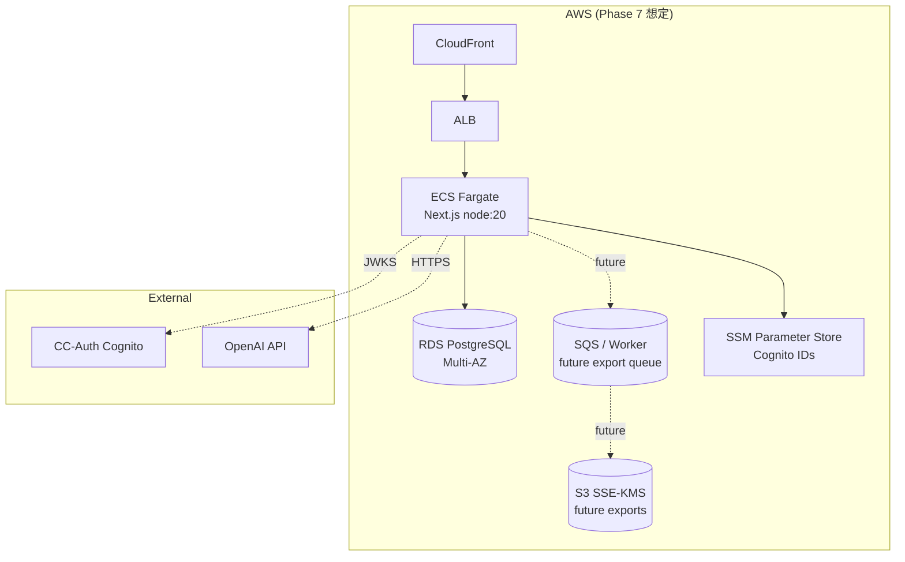

# System Architecture — security-checklist-tool

**Generated**: 2026-04-30 (Phase 6 / Cycle 6.2)
**Source**: `docs/design/spec.md` §1-2 / Phase 4 実装

---

## 1. 全体構成

---

## 2. レイヤー責務

| Layer | 主な責務 | 主要モジュール |
|-------|----------|---------------|
| **Client** | UI / motion/react / role-aware widgets | `src/components/*` (16 files) + `src/hooks/use-event-stream.ts` |
| **Middleware** | Cognito ID token JWKS 検証 / 認証必須経路の cookie ガード | `src/middleware.ts` |
| **Route Handlers** | RBAC 認可 + zod 検証 + Idempotency + SSE + AuditLog | `src/app/api/v1/**/route.ts` (21 routes) |
| **Server libs** | Prisma 拡張 / セッション / SSE / Exporters / Audit | `src/lib/server/*` |
| **Domain libs** | SSRF / LLM / Masking / Sanitize / a11y | `src/lib/{crawler,llm,a11y}` |
| **Data** | Prisma 5 + PostgreSQL 15 + tenant-guard 拡張 | `prisma/schema.prisma` (10 models) |

---

## 3. 主要セキュリティ防御層

| 層 | 仕様 |
|---|------|
| 1. JWT 検証 | jose + remote JWKS / iss + aud 照合 / role 不明時 viewer 丸め |
| 2. RBAC | spec.md §6.2 マトリクスを SSOT 化 (14 actions × 5 roles) |
| 3. zod 検証 | 全 Request body / Query を zod schema で検証 → 400 |
| 4. tenant-guard | Prisma `$extends` で findFirst/findMany/count/findUnique に tenantId を強制 (TenantScopeViolation) |
| 5. SSRF safe-fetch | RFC1918 / loopback / link-local / metadata IPv4/IPv6 deny + DNS pinning + redirect ≤3 hop 再検証 |
| 6. LLM masking | 送信前に email / phone / cc / api-key / AWS key を `<token>` 置換 |
| 7. Markdown XSS | LLM 出力に対し HTML エスケープ + js:/data: スキーマ → "#" 置換 |
| 8. RFC 7807 | すべての非 2xx は `application/problem+json` で詳細を返却 |

---

## 4. データモデル概観 (Prisma 10 models)

| 区分 | Models |
|------|--------|
| **Master (tenant 越え)** | `Guideline`, `GuidelineVersion`, `ControlItem` |
| **Multi-tenant** | `Tenant`, `User`, `Company`, `Assessment`, `AssessmentGuideline`, `AssessmentItem`, `AiChat`, `AuditLog` |

詳細は [prisma/schema.prisma](../../prisma/schema.prisma).

---

## 5. ランタイム / デプロイメント想定

Phase 7 で `aws-fast-deploy` スキル (CloudFront + ECS + ALB + S3) でこの構成を生成する想定。

---

## 6. 関連ドキュメント

- API リファレンス: [`docs/api/api-reference.md`](../api/api-reference.md)
- OpenAPI 3.1 spec: [`docs/api/openapi.json`](../api/openapi.json)
- 設計仕様: [`docs/design/spec.md`](../design/spec.md)
- デザインシステム: [`docs/design/design-system.yml`](../design/design-system.yml)
- 品質ゲート: [`docs/quality/`](../quality/)
- シーケンス図: [`docs/architecture/sequences.md`](./sequences.md)

---
*Phase 6 / Cycle 6.2 — System Architecture (security-checklist-tool)*
