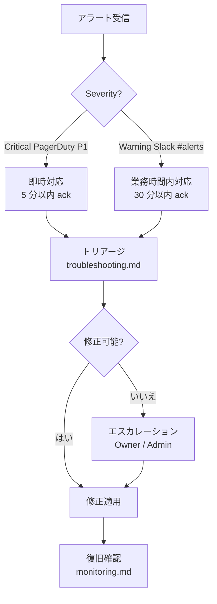

# Runbook — security-checklist-tool

**Generated**: 2026-04-30 (Phase 6 / Cycle 6.4)
**Audience**: SRE / 運用担当 / on-call

---

## 1. 関連 Runbook

| Runbook | 内容 |
|---------|------|
| [deploy.md](./deploy.md) | ローカル / dev / prod デプロイ手順 + ロールバック |
| [troubleshooting.md](./troubleshooting.md) | エラー分類別の一次対応 |
| [monitoring.md](./monitoring.md) | アラート閾値 + メトリクス + ロギング |

---

## 2. システム概観 (運用視点)

| 層 | スタック | SLO 目標 |
|---|---------|---------|
| Frontend | Next.js 14 App Router (Node 20) | LCP < 2.5s |
| API | Next.js Route Handlers (Node 20) | p95 < 1s / 5xx < 1% |
| DB | PostgreSQL 15 (RDS Multi-AZ 想定) | CPU < 70% / RPO 24h |
| 認証 | CC-Auth Cognito (OIDC PKCE) | JWKS verify < 100ms |
| LLM | OpenAI Chat Completions (data opt-out) | timeout 30s / 連続失敗 5xx で circuit open |
| Crawler | safe-fetch (deny-by-default SSRF) | timeout 10s / max 5MB |

詳細: [`docs/architecture/system.md`](../architecture/system.md)

---

## 3. オンコール フロー

---

## 4. 共通参照

- [spec.md §9 (障害設計)](../design/spec.md#9-エラーハンドリング・障害設計)
- [spec.md §9.6 (UI エラー文言)](../design/spec.md#96-ユーザー向け表示)
- [docs/quality/](../quality/) — 品質ゲートレポート

---
*Phase 6 / Cycle 6.4 — Runbook Index (security-checklist-tool)*
